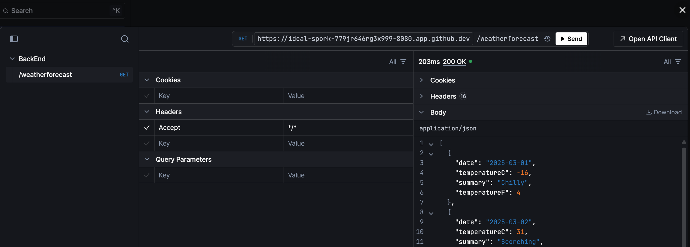
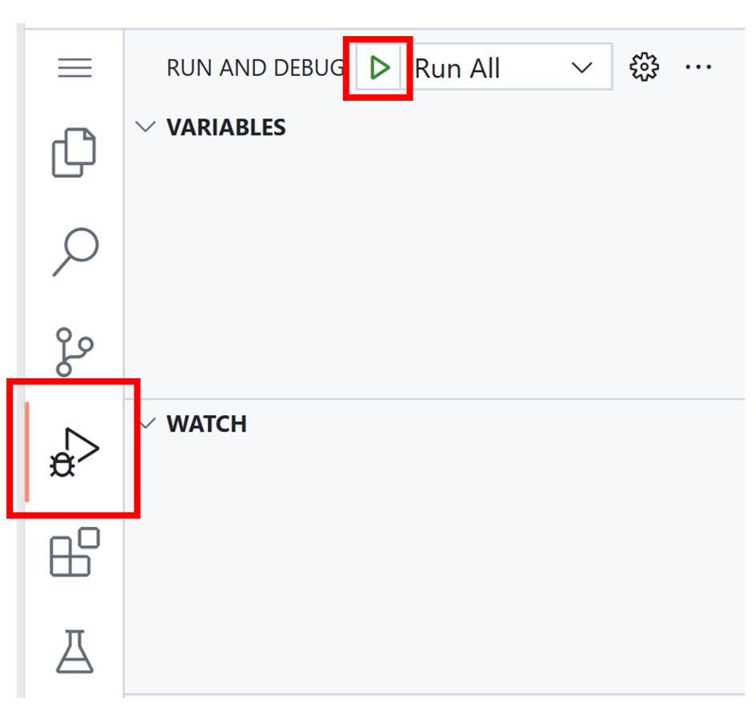

# .NET 9.0 Sample Application - Crispy Barnacle 🐙

[English](#english) | [Polski](#polski)

---

## English

### Overview

A modern, microservices-based sample application built with .NET 9.0, demonstrating best practices in ASP.NET Core Web API and Blazor Server development. This project showcases a complete e-commerce and weather forecast system with RESTful APIs, interactive UI, and comprehensive API documentation using Scalar.

### Features

- **Backend API** (ASP.NET Core Minimal API):
  - Weather forecast service
  - Product catalog management (CRUD operations)
  - User management with data validation
  - Order processing with status tracking
  - Contact form submission
  - OpenAPI/Swagger documentation with Scalar UI
  
- **Frontend Application** (Blazor Server):
  - Real-time weather forecast display
  - Interactive contact form with validation
  - Responsive Bootstrap-based UI
  - Server-side rendering for optimal performance

### Technology Stack

- **.NET 9.0**
- **ASP.NET Core** (Minimal APIs)
- **Blazor Server**
- **OpenAPI/Swagger** with Scalar UI
- **Bootstrap 5** for styling
- **C# 13** with nullable reference types

### Project Structure

```
SampleApp/
├── BackEnd/              # ASP.NET Core Web API
│   ├── Models/           # Domain models
│   │   ├── Dto/         # Data Transfer Objects
│   │   └── Validation/  # Business logic validation
│   └── Program.cs       # API endpoints and configuration
├── FrontEnd/            # Blazor Server application
│   ├── Data/            # HTTP clients and data models
│   ├── Pages/           # Razor components
│   └── Program.cs       # App configuration
└── SampleApp.sln        # Solution file
```

### Run Options

[](https://codespaces.new/wojcikwojtek/crispy-barnacle)
[](https://vscode.dev/redirect?url=vscode://ms-vscode-remote.remote-containers/cloneInVolume?url=https://github.com/wojcikwojtek/crispy-barnacle)

### Quick Start

#### Prerequisites

- [.NET 9.0 SDK](https://dotnet.microsoft.com/download/dotnet/9.0)
- [Visual Studio Code](https://code.visualstudio.com/) or [Visual Studio 2022](https://visualstudio.microsoft.com/)

#### Local Development

1. **Clone the repository**
   ```bash
   git clone https://github.com/wojcikwojtek/crispy-barnacle.git
   cd crispy-barnacle
   ```

2. **Build the solution**
   ```bash
   cd SampleApp
   dotnet build
   ```

3. **Run both applications**
   
   Use VS Code's built-in *Run All* command, or run manually:
   
   **Terminal 1 - Backend API:**
   ```bash
   cd SampleApp/BackEnd
   dotnet run
   ```
   Backend will be available at: `http://localhost:5001` (or as configured)
   
   **Terminal 2 - Frontend App:**
   ```bash
   cd SampleApp/FrontEnd
   dotnet run
   ```
   Frontend will be available at: `http://localhost:5002` (or as configured)

4. **Access the applications**
   - **Frontend UI**: Navigate to `http://localhost:5002`
   - **API Documentation**: Navigate to `http://localhost:5001/scalar`
   - **Weather Forecast**: View on the frontend home page
   - **Contact Form**: Navigate to `/contact` on the frontend

#### Using GitHub Codespaces

1. Click the **Open in GitHub Codespaces** badge above
2. Wait for the environment to be configured
3. Press F5 or use the "Run All" command in VS Code
4. The ports will be forwarded automatically
5. Access the Scalar API documentation at `/scalar`

### API Endpoints

The backend API provides the following endpoints:

#### Weather Forecast
- `GET /weatherforecast` - Get 5-day weather forecast

#### Products
- `GET /api/products` - Get all products
- `GET /api/products/{id}` - Get product by ID
- `POST /api/products` - Create new product
- `PUT /api/products/{id}` - Update product
- `DELETE /api/products/{id}` - Delete product

#### Users
- `GET /api/users` - Get all users (sensitive data excluded)
- `GET /api/users/{id}` - Get user by ID
- `POST /api/users` - Create new user
- `PUT /api/users/{id}` - Update user
- `DELETE /api/users/{id}` - Delete user

#### Orders
- `GET /api/orders` - Get all orders
- `GET /api/orders/{id}` - Get order by ID
- `POST /api/orders` - Create new order
- `PUT /api/orders/{id}/status` - Update order status

#### Contact
- `POST /api/contact` - Submit contact message

For detailed API documentation, run the backend and navigate to `/scalar`.

### Architecture

This application follows a microservices architecture pattern:

- **Backend Service**: Handles all business logic and data persistence (in-memory for demo purposes)
- **Frontend Service**: Provides the user interface using Blazor Server
- **Communication**: HTTP/REST APIs between frontend and backend
- **API Documentation**: Integrated OpenAPI/Swagger with Scalar UI

### Development

#### Configuration

The applications use configuration files for environment-specific settings:

**Backend** (`BackEnd/appsettings.json`):
- API settings
- CORS policies
- Logging configuration

**Frontend** (`FrontEnd/appsettings.json`):
- `WEATHER_URL`: Backend API URL for weather service
- `API_URL`: Backend API base URL

#### Adding New Features

1. **New API Endpoint**: Add to `BackEnd/Program.cs` with `.WithOpenApi()` for documentation
2. **New Model**: Create in `BackEnd/Models/` with appropriate DTOs
3. **New Page**: Add Razor component to `FrontEnd/Pages/`
4. **New Service**: Create HTTP client in `FrontEnd/Data/`

### Testing

The application includes interactive API testing via Scalar:

1. Run the backend application
2. Navigate to `/scalar`
3. Select any endpoint
4. Click "Test Request" to try the API
5. View request/response details

### Contributing

Contributions are welcome! Please feel free to submit a Pull Request.

### License

This project may contain trademarks or logos for projects, products, or services. Authorized use of Microsoft trademarks or logos is subject to and must follow [Microsoft's Trademark & Brand Guidelines](https://www.microsoft.com/en-us/legal/intellectualproperty/trademarks/usage/general).

---

## Polski

### Przegląd

Nowoczesna aplikacja demonstracyjna oparta na architekturze mikroserwisów, zbudowana z użyciem .NET 9.0. Projekt prezentuje najlepsze praktyki w rozwoju aplikacji ASP.NET Core Web API i Blazor Server. System obejmuje funkcjonalności e-commerce oraz prognozę pogody z interfejsami RESTful API, interaktywnym UI oraz kompleksową dokumentacją API przy użyciu Scalar.

### Funkcjonalności

- **API Backendu** (ASP.NET Core Minimal API):
  - Serwis prognozy pogody
  - Zarządzanie katalogiem produktów (operacje CRUD)
  - Zarządzanie użytkownikami z walidacją danych
  - Przetwarzanie zamówień ze śledzeniem statusu
  - Obsługa formularza kontaktowego
  - Dokumentacja OpenAPI/Swagger z interfejsem Scalar
  
- **Aplikacja Frontendowa** (Blazor Server):
  - Wyświetlanie prognozy pogody w czasie rzeczywistym
  - Interaktywny formularz kontaktowy z walidacją
  - Responsywny interfejs oparty na Bootstrap
  - Renderowanie po stronie serwera dla optymalnej wydajności

### Stack Technologiczny

- **.NET 9.0**
- **ASP.NET Core** (Minimal APIs)
- **Blazor Server**
- **OpenAPI/Swagger** z interfejsem Scalar
- **Bootstrap 5** do stylowania
- **C# 13** z nullable reference types

### Struktura Projektu

```
SampleApp/
├── BackEnd/              # ASP.NET Core Web API
│   ├── Models/           # Modele domenowe
│   │   ├── Dto/         # Obiekty transferu danych
│   │   └── Validation/  # Walidacja logiki biznesowej
│   └── Program.cs       # Endpointy API i konfiguracja
├── FrontEnd/            # Aplikacja Blazor Server
│   ├── Data/            # Klienty HTTP i modele danych
│   ├── Pages/           # Komponenty Razor
│   └── Program.cs       # Konfiguracja aplikacji
└── SampleApp.sln        # Plik rozwiązania
```

### Opcje Uruchomienia

[](https://codespaces.new/wojcikwojtek/crispy-barnacle)
[](https://vscode.dev/redirect?url=vscode://ms-vscode-remote.remote-containers/cloneInVolume?url=https://github.com/wojcikwojtek/crispy-barnacle)

### Szybki Start

#### Wymagania

- [.NET 9.0 SDK](https://dotnet.microsoft.com/download/dotnet/9.0)
- [Visual Studio Code](https://code.visualstudio.com/) lub [Visual Studio 2022](https://visualstudio.microsoft.com/)

#### Rozwój Lokalny

1. **Sklonuj repozytorium**
   ```bash
   git clone https://github.com/wojcikwojtek/crispy-barnacle.git
   cd crispy-barnacle
   ```

2. **Zbuduj rozwiązanie**
   ```bash
   cd SampleApp
   dotnet build
   ```

3. **Uruchom obie aplikacje**
   
   Użyj wbudowanej komendy VS Code *Run All*, lub uruchom ręcznie:
   
   **Terminal 1 - API Backendu:**
   ```bash
   cd SampleApp/BackEnd
   dotnet run
   ```
   Backend będzie dostępny pod: `http://localhost:5001` (lub zgodnie z konfiguracją)
   
   **Terminal 2 - Aplikacja Frontendowa:**
   ```bash
   cd SampleApp/FrontEnd
   dotnet run
   ```
   Frontend będzie dostępny pod: `http://localhost:5002` (lub zgodnie z konfiguracją)

4. **Dostęp do aplikacji**
   - **UI Frontendu**: Przejdź do `http://localhost:5002`
   - **Dokumentacja API**: Przejdź do `http://localhost:5001/scalar`
   - **Prognoza Pogody**: Widoczna na stronie głównej frontendu
   - **Formularz Kontaktowy**: Przejdź do `/contact` na frontendzie

#### Używanie GitHub Codespaces

1. Kliknij przycisk **Otwórz w GitHub Codespaces** powyżej
2. Poczekaj na skonfigurowanie środowiska
3. Naciśnij F5 lub użyj komendy "Run All" w VS Code
4. Porty zostaną automatycznie przekierowane
5. Uzyskaj dostęp do dokumentacji API Scalar pod `/scalar`

### Endpointy API

API backendu udostępnia następujące endpointy:

#### Prognoza Pogody
- `GET /weatherforecast` - Pobierz 5-dniową prognozę pogody

#### Produkty
- `GET /api/products` - Pobierz wszystkie produkty
- `GET /api/products/{id}` - Pobierz produkt po ID
- `POST /api/products` - Utwórz nowy produkt
- `PUT /api/products/{id}` - Zaktualizuj produkt
- `DELETE /api/products/{id}` - Usuń produkt

#### Użytkownicy
- `GET /api/users` - Pobierz wszystkich użytkowników (bez danych wrażliwych)
- `GET /api/users/{id}` - Pobierz użytkownika po ID
- `POST /api/users` - Utwórz nowego użytkownika
- `PUT /api/users/{id}` - Zaktualizuj użytkownika
- `DELETE /api/users/{id}` - Usuń użytkownika

#### Zamówienia
- `GET /api/orders` - Pobierz wszystkie zamówienia
- `GET /api/orders/{id}` - Pobierz zamówienie po ID
- `POST /api/orders` - Utwórz nowe zamówienie
- `PUT /api/orders/{id}/status` - Zaktualizuj status zamówienia

#### Kontakt
- `POST /api/contact` - Wyślij wiadomość kontaktową

Szczegółową dokumentację API można znaleźć uruchamiając backend i przechodząc do `/scalar`.

### Architektura

Aplikacja wykorzystuje wzorzec architektury mikroserwisów:

- **Serwis Backendu**: Obsługuje całą logikę biznesową i trwałość danych (w pamięci dla celów demonstracyjnych)
- **Serwis Frontendu**: Dostarcza interfejs użytkownika przy użyciu Blazor Server
- **Komunikacja**: HTTP/REST API pomiędzy frontendem a backendem
- **Dokumentacja API**: Zintegrowana OpenAPI/Swagger z interfejsem Scalar

### Rozwój

#### Konfiguracja

Aplikacje używają plików konfiguracyjnych dla ustawień specyficznych dla środowiska:

**Backend** (`BackEnd/appsettings.json`):
- Ustawienia API
- Polityki CORS
- Konfiguracja logowania

**Frontend** (`FrontEnd/appsettings.json`):
- `WEATHER_URL`: URL API backendu dla serwisu pogodowego
- `API_URL`: Bazowy URL API backendu

#### Dodawanie Nowych Funkcji

1. **Nowy Endpoint API**: Dodaj do `BackEnd/Program.cs` z `.WithOpenApi()` dla dokumentacji
2. **Nowy Model**: Utwórz w `BackEnd/Models/` z odpowiednimi DTO
3. **Nowa Strona**: Dodaj komponent Razor do `FrontEnd/Pages/`
4. **Nowy Serwis**: Utwórz klienta HTTP w `FrontEnd/Data/`

### Testowanie

Aplikacja zawiera interaktywne testowanie API za pomocą Scalar:

1. Uruchom aplikację backendu
2. Przejdź do `/scalar`
3. Wybierz dowolny endpoint
4. Kliknij "Test Request" aby przetestować API
5. Zobacz szczegóły żądania/odpowiedzi

### Wkład w Projekt

Wkłady są mile widziane! Prosimy o swobodne składanie Pull Requestów.

### Licencja

Ten projekt może zawierać znaki towarowe lub logo projektów, produktów lub usług. Autoryzowane użycie znaków towarowych lub logo Microsoft podlega i musi być zgodne z [Wytycznymi dotyczącymi Znaków Towarowych i Marki Microsoft](https://www.microsoft.com/en-us/legal/intellectualproperty/trademarks/usage/general).

---

## Additional Documentation

- [API Documentation](docs/API.md) - Detailed API endpoint documentation
- [Architecture Guide](docs/ARCHITECTURE.md) - System architecture and design patterns
- [Development Guide](docs/DEVELOPMENT.md) - Setup and development guidelines
- [Quick Reference](docs/QUICK_REFERENCE.md) - Common commands and tasks
- [Contributing Guide](CONTRIBUTING.md) - How to contribute to this project
- [Changelog](CHANGELOG.md) - Project history and roadmap

## Screenshots

### Weather Forecast


### API Documentation (Scalar)


### Debug and Run

